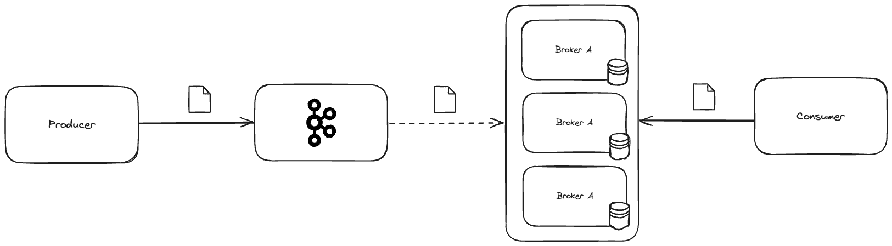
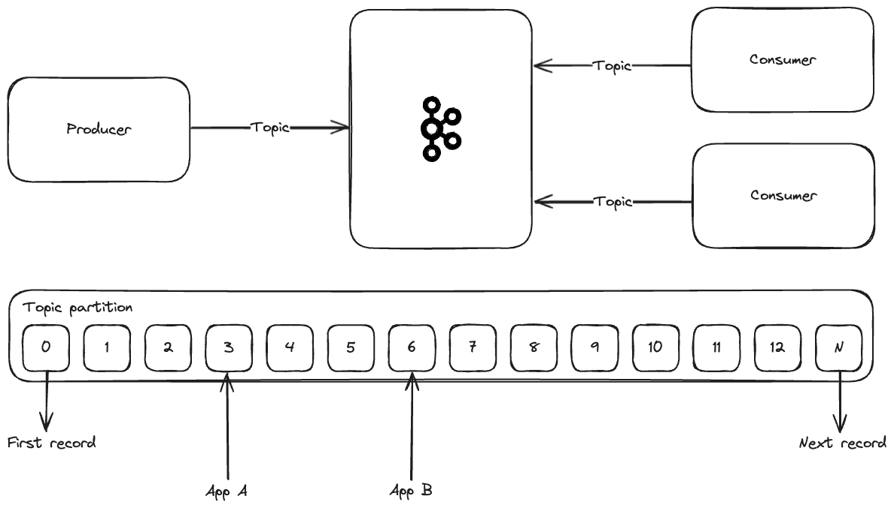

# Apache Kafka 

Apache Kafka is an open-source distributed event streaming platform used by thousands of companies to build high-performance data pipelines, stream analytics, and enable crucial data integration.

Each day events are becoming more and more important in the world of software development. The ability to react to events in real-time is crucial for many applications. Events are present in the comunication between simple systems, IOT devices, in the monitoring of complex systems, and many other scenarios.

## Kafka superpowers

- **High throughput**: It can handle a large number of messages per second, which means it scales pretty well;
- **Very low latency (2ms)**: It can process messages very quickly, which is crucial for real-time applications;
- **Storage**: It can store large amounts of data for a long time, which is crucial for data analytics, for example;
- **High availability**: It can be configured to be fault-tolerant, which means it can be used in critical applications;
- **It's available everywhere**: It can be deployed on-premises, in the cloud, and even in Kubernetes. It also connects to many languages and frameworks like Java, Python, Go, and many others.
- **It's open-source**: It's free to use and has a large community behind it.

## The foundation

Kafka is built on top of a few key concepts:

- **Producers**: They are the ones that produce messages to Kafka topics;
- **Consumers**: They are the ones that consume messages from Kafka topics;
- **Topics**: They are the channels where messages are sent to;
- **Partitions**: They are the way Kafka scales topics. Each topic can be divided into partitions, which can be distributed across different brokers;
- **Brokers**: They are the servers that store the messages;
- **ZooKeeper**: It's a service that manages the brokers and the topics;

Below is a diagram that shows how these concepts are connected:

### Topics

Topics are the channels where messages are sent to and consumed from. When messages are sent to a topic, they are stored in partitions. Each partition is an ordered, immutable sequence of messages that is continually appended to—a commit log. This allows multiple consumers to read from a topic in parallel, for example.

